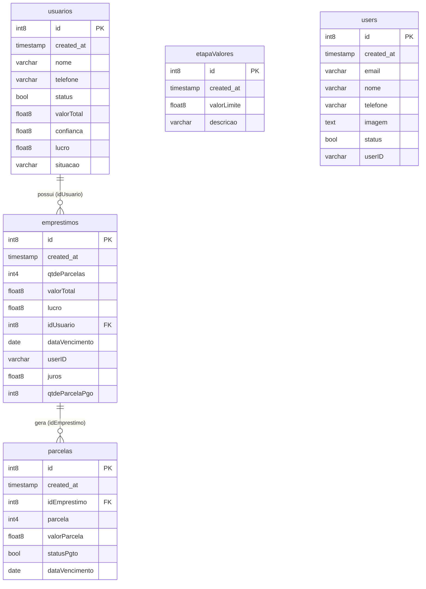

# AnaliseCredito

Um aplicativo simples de análise de crédito e gerenciamento de empréstimos, desenvolvido com **Flutter** e **FlutterFlow**, utilizando integração com **Supabase** como backend.

## 📱 Sobre o Projeto

O **AnaliseCredito** é uma aplicação voltada para o controle e acompanhamento de clientes e suas parcelas de pagamento. Através de uma interface intuitiva, a aplicação permite o cadastro de clientes, adição de empréstimos, gerenciamento do pagamento de parcelas e o controle do perfil do usuário. 

### Funcionalidades Principais
*   **Autenticação**: Login e Cadastro de novos usuários através do Supabase Auth.
*   **Dashboard (Home)**: Visão geral com informações rápidas sobre o sistema e métricas principais.
*   **Gestão de Clientes**: Telas para adicionar, visualizar e editar os detalhes dos clientes cadastrados no sistema.
*   **Gestão de Empréstimos e Pagamentos**: Registro de novos empréstimos por cliente e acompanhamento/realização do pagamento das parcelas (`RealizarPgtoWidget`).
*   **Perfil do Usuário**: Exibição e edição das informações do usuário logado no sistema.

## 🗄️ Estrutura do Banco de Dados
O backend utiliza PostgreSQL (via Supabase) com foco em integridade referencial. Abaixo, o Diagrama de Entidade-Relacionamento (ER) do sistema:



## 🏗️ Arquitetura e Estrutura de Diretórios

O projeto utiliza a organização de pastas padrão gerada e exportada pelo FlutterFlow. A navegação base e a gestão de estado dependem da associação do pacote `GoRouter`, `Provider` (AppState) e do próprio `State` gerenciado nativamente pelo FlutterFlow.

*   `lib/autenticacao/`: Telas e widgets de login, criação e finalização de contas.
*   `lib/auth/`: Lógica central e controle de sessão do usuário no app (SupabaseUserProvider).
*   `lib/backend/`: Interações com o backend (Supabase), abrangendo funções, Realtime, armazenamento (Storage) e consultas via PostgREST.
*   `lib/telas_primarias/`: Núcleo da navegação por abas BottomNavigationBar (Home, Lista, Perfil).
*   `lib/tela_secundaria/`: Fluxos específicos como a visualização profunda, edição ou processo de cadastro de um único cliente ou de um empréstimo.
*   `lib/lista_parcelas_pgto/`: Lógicas e visões do gerenciamento e efetivação de pagamentos das parcelas.
*   `lib/editar_perfil/`: Telas e componentes dedicados à modificação de dados pessoais da conta.
*   `lib/flutter_flow/`: Core das instâncias geradas, utilidades, animações e o design system próprio (Cores, Fontes e Temas).

## 🛠️ Tecnologias Utilizadas

A aplicação conta com bibliotecas robustas do ecossistema Dart para garantir excelente performance e fidelidade ao design desenhado. As principais tecnologias ativas no `pubspec.yaml` são:
*   **[Flutter](https://flutter.dev/)** / **[Dart](https://dart.dev/)**: SDK de interface de usuário (UI).
*   **[FlutterFlow](https://flutterflow.io/)**: Plataforma de orquestramento de UI e exportação de código.
*   **[Supabase](https://supabase.com/)** (`supabase_flutter`): Plataforma Backend-as-a-Service Open Source.
*   **[GoRouter](https://pub.dev/packages/go_router)**: Roteamento por URL reflexiva no ecossistema Flutter.
*   **[Provider](https://pub.dev/packages/provider)**: Encapsulamento de dependências e reatividade de estado (`FFAppState`).
*   **Outros pacotes de destaque**: 
    * `sqflite` e `hive` para instâncias de persistência de dados localmente.
    * `rxdart` para Streams assíncronos.
    * Extensões visuais e helpers como `font_awesome_flutter`, `auto_size_text` e `cached_network_image`.

## 🚀 Como Executar o Projeto

Para compilar este projeto no seu ambiente de desenvolvimento local, atente-se aos requisitos:
*   Ter o [Flutter SDK](https://docs.flutter.dev/get-started/install) nas versões suportadas (`>=3.0.0 <4.0.0`).
*   Credenciais ativas do banco de dados relacional e serviços [Supabase](https://supabase.com/).

Siga os seguintes passos para configuração:

1. Clone o projeto para o seu diretório local ou abra via IDE (VSCode / Android Studio).
2. Acesse a pasta raiz do projeto atravéz do terminal:
   ```bash
   cd caminho/do/seu/projeto
   ```
3. Instale todas as dependências atreladas no `pubspec`:
   ```bash
   flutter pub get
   ```
4. Modifique as constantes/variáveis do Supabase se necessário, apontando sua chave e URL próprias ou as geradas pelo provedor no FlutterFlow.
5. Conecte um emulador Android, dispositivo iOS físico ou libere uma porta web local. Em seguida, inicie o aplicativo:
   ```bash
   flutter run
   ```
